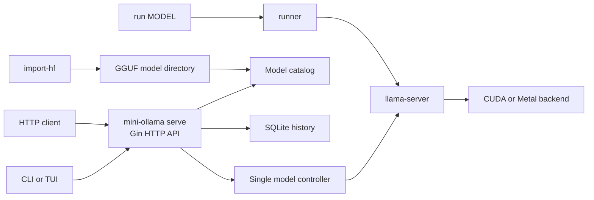
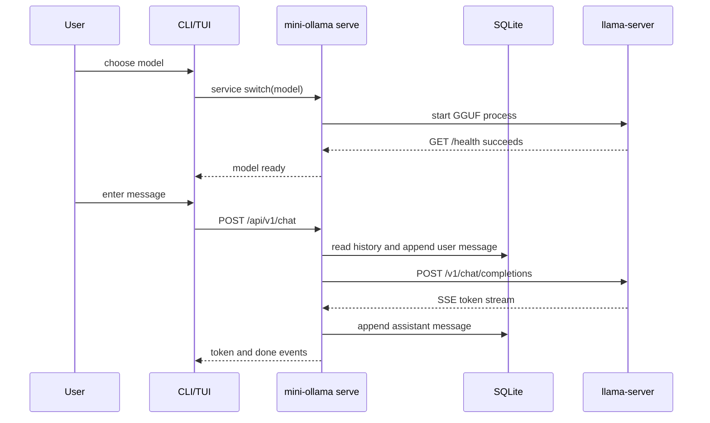

# mini-ollama

mini-ollama is a Go command-line application for running local GGUF models through llama.cpp `llama-server`. It provides a persistent local service, a custom HTTP API, a CLI chat client, and a Bubble Tea terminal interface.

Linux with CUDA is the primary validation target. The project loads one model at a time and uses `CUDA_VISIBLE_DEVICES` to select the visible CUDA device. Multi-GPU scheduling, remote access, authentication, and an OpenAI-compatible API are not part of the current implementation.

## Current Features

- `serve` keeps the mini-ollama API running and owns the llama-server process.
- `models` scans a model directory, reads optional `manifest.json` metadata, and verifies size and SHA-256 values.
- `run` starts llama-server directly for a GGUF path.
- `chat` sends multi-turn messages through the mini-ollama API and prints SSE tokens.
- `tui` provides model selection, explicit model switching, stopping, directory refresh, and streaming chat.
- `stop` and `switch MODEL` control the single loaded model explicitly.
- SQLite stores conversations and messages for the custom chat API.
- `import-hf` downloads a fixed Hugging Face revision, converts HF weights to GGUF, quantizes Q4_K_M, verifies output, and publishes a model manifest.
- Model files, download caches, conversion files, and published GGUF files can be kept outside the source tree.

## Architecture



In API mode, `serve` owns the llama-server process. `run MODEL` is the separate direct process path. The TUI and external clients communicate with `serve`; they do not start another model process. The API exposes model names and keeps local GGUF paths inside the server.

## Request Workflow



## Requirements

- Go 1.25 or later.
- A built llama.cpp `llama-server` at `build/llama-server/bin/llama-server`.
- Linux with CUDA for the primary path. The build script also contains a macOS arm64 Metal configuration.
- Python dependencies for HF conversion are installed in a conda environment.

The source tree treats `third_party/llama.cpp` as an external checkout. The official Ollama source is reference material only and is not part of the build or runtime path.

## Build llama.cpp

Run the setup and build scripts from the repository root:

```bash
source ~/.bashrc
./scripts/bootstrap.sh
./scripts/build-llama-server.sh
cmake --build build/llama-server --target llama-quantize --parallel 4
go build -o /tmp/mini-ollama .
```

On Linux, the build script enables CUDA and uses CUDA architecture 86 for RTX 3090-class GPUs. Keep model files and large build or conversion outputs on the external model storage selected for the machine.

## Model Directory

The default model directory is `~/.mini-ollama/models`. Override it with `--models-dir` or `MINI_OLLAMA_MODELS_DIR`.

A directory containing one GGUF file is a model entry. A directory may also contain `manifest.json`:

```text
models/
└── Llama-3.2-1B-Instruct-GGUF/
    ├── Llama-3.2-1B-Instruct-GGUF.Q4_K_M.gguf
    └── manifest.json
```

The catalog uses the directory name by default. A manifest can provide the displayed name, description, selected GGUF file, size, and SHA-256 value.

## Run the Service

The API listens on `127.0.0.1:11434` by default. Keep the SQLite directory on a local writable filesystem when the model directory is a CephFS/NFS mount; the model and conversion files can remain on CephFS.

```bash
CUDA_VISIBLE_DEVICES=0 \
/tmp/mini-ollama serve \
  --models-dir /path/to/models \
  --data-dir /tmp/mini-ollama-data \
  --device 0 \
  --gpu-layers all
```

Useful commands:

```bash
/tmp/mini-ollama models --models-dir /path/to/models --verify
/tmp/mini-ollama models --models-dir /path/to/models --refresh
/tmp/mini-ollama switch MODEL_NAME
/tmp/mini-ollama stop
/tmp/mini-ollama chat MODEL_NAME
/tmp/mini-ollama tui --server http://127.0.0.1:11434
```

The TUI uses the HTTP API. Enter selects or switches a model, text followed by Enter sends a message, Ctrl-S stops the model, Ctrl-R refreshes the model list, and Ctrl-C exits.

## HTTP API

All custom routes use the `/api/v1` prefix:

| Method | Route | Purpose |
| --- | --- | --- |
| `GET` | `/api/v1/health` | Check that the API responds |
| `GET` | `/api/v1/models` | List the model catalog |
| `POST` | `/api/v1/models/refresh` | Rescan the model directory |
| `GET` | `/api/v1/status` | Read lifecycle and request status |
| `POST` | `/api/v1/chat` | Chat with a SQLite-backed conversation; supports SSE |
| `POST` | `/api/v1/conversations` | Create a conversation |
| `GET` | `/api/v1/conversations` | List conversations |
| `GET` | `/api/v1/conversations/:id` | Read a conversation and its messages |
| `DELETE` | `/api/v1/conversations/:id` | Delete a conversation |
| `POST` | `/api/v1/service/stop` | Stop the loaded model |
| `POST` | `/api/v1/service/switch` | Stop the current model and load another |

The chat request identifies the model by name and sends a `conversation_id` plus one message. Streaming responses use `token`, `error`, and `done` SSE events.

## Hugging Face Import

`import-hf` accepts either a fixed Hugging Face revision or an existing local HF weight directory. It writes the download cache and conversion intermediates to `--work-dir`, then publishes a new model directory under `--models-dir`. The source weights are not overwritten.

```bash
source ~/.bashrc
conda activate mini-ollama-hf
/tmp/mini-ollama import-hf MODEL_NAME \
  --repo OWNER/REPO \
  --revision 40-character-commit-sha \
  --models-dir /path/to/models \
  --work-dir /path/to/external/cache \
  --python "$(command -v python)" \
  --quantizer build/llama-server/bin/llama-quantize
```

For existing local HF weights, replace `--repo` and `--revision` with `--source-dir /path/to/hf-weights`.

The downloader uses the configured proxy and defaults to the Hugging Face mirror used by the project scripts. A private repository receives only a token file path through `--token-file`; token contents are not printed or stored in manifests.

## Tests

Run the automated checks from the repository root:

```bash
go test ./...
go test -race ./...
go vet ./...
python -m unittest discover -s scripts -p 'test_hf_snapshot.py' -v
```

The primary end-to-end target is Linux with CUDA, using at least one 1B and one 8B GGUF model. macOS support remains a later validation target.

## License

This project is licensed under the MIT License. See [LICENSE](LICENSE).
