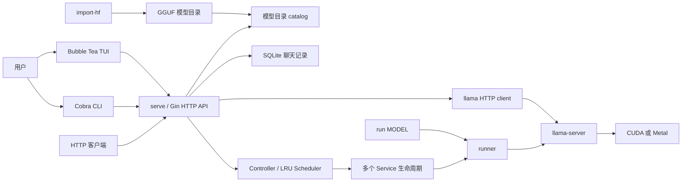
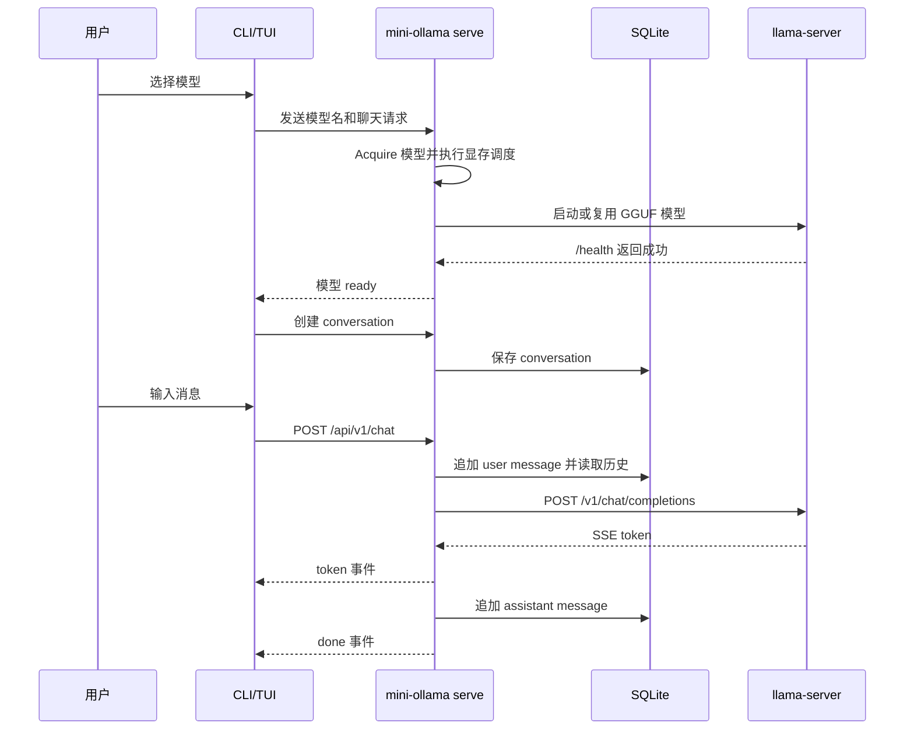

<a id="readme-top"></a>

<br>

<div id="user-content-toc">
  <ul align="center">
    <summary><h1 style="display: inline-block"><b>🌠 mini-ollama</b></h1></summary>
    <p>基于 Go 与 llama.cpp 的本地 GGUF 模型命令行工具</p>
    <p><i>A local GGUF model CLI powered by Go and llama.cpp</i></p>
    <br />
    <a href="#-快速开始">快速开始</a>
    &middot;
    <a href="#-http-api">HTTP API</a>
    &middot;
    <a href="https://github.com/LulietLyan/mini-ollama/issues/new?labels=bug">报告问题</a>
    &middot;
    <a href="https://github.com/LulietLyan/mini-ollama/issues/new?labels=enhancement">功能建议</a>
  </ul>
</div>

<p align="center">
  
  
  
  
  
  
</p>

<p align="center">
  
  &nbsp;&nbsp;&nbsp;
  
</p>

<br>

# 📕 目录

- [📕 目录](#-目录)
- [🤔 项目简介](#-项目简介)
- [✨ 已实现功能](#-已实现功能)
- [🏗️ 系统架构](#️-系统架构)
- [🔄 聊天流程](#-聊天流程)
- [😋 快速开始](#-快速开始)
  - [环境要求](#环境要求)
  - [获取和构建 llama.cpp](#获取和构建-llamacpp)
  - [启动服务](#启动服务)
- [📂 模型目录](#-模型目录)
- [🖥️ 命令行与 TUI](#️-命令行与-tui)
- [🌐 HTTP API](#-http-api)
- [🤗 Hugging Face 导入](#-hugging-face-导入)
- [🧪 测试](#-测试)
- [❗ 授权说明](#-授权说明)

# 🤔 项目简介

**mini-ollama** 是一个学习型 Go 项目，通过 llama.cpp 的 `llama-server` 运行本地 GGUF 模型。项目提供 Cobra 命令行、Gin HTTP API、Bubble Tea 终端界面和 SQLite 聊天记录，不重新实现模型推理。

Linux + CUDA 是当前主要验收环境。服务模式可以按配置驻留多个模型，并在聊天请求到达时自动加载和调度；`run MODEL` 仍然可以绕过服务 API，直接启动一个 llama-server 进程。

<p align="right">(<a href="#readme-top">返回顶部</a>)</p>

# ✨ 已实现功能

- 扫描本地 GGUF 模型目录，并支持 `manifest.json` 元数据。
- 校验模型大小和 SHA-256。
- 启动、健康检查、停止和显式切换 llama-server。
- 支持显式多 GPU 切分，以及基于 `nvidia-smi` 空闲显存的自动 GPU 分配。
- 支持多个模型驻留、空闲模型 LRU 淘汰和请求期间的模型引用保护。
- 提供 CLI 多轮聊天和 SSE 流式输出。
- 使用 SQLite 保存 conversation 和 message。
- 提供模型选择、停止、刷新和聊天 TUI。
- 提供 health、models、status、metrics、chat、conversations、service control 和 OpenAI 风格 `/v1` API。
- 从固定 Hugging Face commit 下载并校验权重。
- 调用 llama.cpp 转换脚本和 `llama-quantize` 生成 Q4_K_M GGUF。
- 支持已有本地 HF 权重的离线转换，不覆盖原始权重。

<p align="right">(<a href="#readme-top">返回顶部</a>)</p>

# 🏗️ 系统架构



在服务模式下，`serve` 通过 Controller 和 Service 管理 llama-server。TUI、`chat`、`stop`、`switch` 和外部 HTTP 客户端都连接同一个 API。模型路径只在服务端目录映射中使用，客户端只传递模型名。

<p align="right">(<a href="#readme-top">返回顶部</a>)</p>

# 🔄 聊天流程



<p align="right">(<a href="#readme-top">返回顶部</a>)</p>

# 😋 快速开始

## 环境要求

- Go 1.25 或更高版本。
- Linux + CUDA，或构建脚本中支持的 macOS arm64 Metal 环境。
- CMake、Ninja 和可用的 C/C++ 编译器。
- Hugging Face 转换依赖安装在 conda 环境中。

## 获取和构建 llama.cpp

```bash
git clone https://github.com/LulietLyan/mini-ollama.git
cd mini-ollama

source ~/.bashrc
./scripts/bootstrap.sh
./scripts/build-llama-server.sh
cmake --build build/llama-server --target llama-quantize --parallel 4
go build -o /tmp/mini-ollama .
```

Linux 构建脚本启用 CUDA，并按当前项目环境设置 CUDA architecture 86。`llama-server` 的默认查找路径是：

```text
build/llama-server/bin/llama-server
```

## 启动服务

模型和转换文件可以放在 CephFS 等大容量存储中。SQLite 应放在支持文件锁的本地可写文件系统中。

```bash
CUDA_VISIBLE_DEVICES=0 \
/tmp/mini-ollama serve \
  --models-dir /path/to/models \
  --data-dir /tmp/mini-ollama-data \
  --device 0 \
  --gpu-layers all
```

自动显存分配和多模型调度：

```bash
/tmp/mini-ollama serve \
  --models-dir /path/to/models \
  --data-dir /tmp/mini-ollama-data \
  --auto-gpu \
  --gpu-memory-fraction 0.90 \
  --memory-reserve-mib 512 \
  --max-loaded-models 2
```

`--auto-gpu` 会读取 `nvidia-smi` 的空闲显存，按 GGUF 大小、上下文和保留空间估算需求，选择一张或多张 GPU，并生成 `CUDA_VISIBLE_DEVICES`、`--split-mode` 和 `--tensor-split`。模型请求会自动加载目标模型；达到 `--max-loaded-models` 后，只淘汰没有正在处理请求的最久未使用模型。

默认 API 地址：`http://127.0.0.1:11434`。

<p align="right">(<a href="#readme-top">返回顶部</a>)</p>

# 📂 模型目录

默认模型目录为 `~/.mini-ollama/models`，可通过 `--models-dir` 或 `MINI_OLLAMA_MODELS_DIR` 覆盖。

```text
models/
├── Qwen3-8B-GGUF/
│   ├── Qwen3-8B-Q4_K_M.gguf
│   └── manifest.json
└── Llama-3.2-1B-Instruct-Q4_K_M.gguf
```

顶层 `.gguf` 文件直接作为模型。模型子目录中存在一个 GGUF 时，目录名默认作为模型名；`manifest.json` 可以指定名称、描述、GGUF 文件、文件大小和 SHA-256。

```bash
/tmp/mini-ollama models --models-dir /path/to/models
/tmp/mini-ollama models --models-dir /path/to/models --verify
/tmp/mini-ollama models --models-dir /path/to/models --refresh
```

<p align="right">(<a href="#readme-top">返回顶部</a>)</p>

# 🖥️ 命令行与 TUI

| 命令 | 作用 |
| --- | --- |
| `version` | 显示 llama-server 版本 |
| `run MODEL` | 使用 GGUF 路径直接运行 llama-server |
| `serve [MODEL]` | 启动模型管理和 HTTP API，可选初始模型 |
| `models` | 列出或校验模型目录 |
| `chat MODEL` | 通过 mini-ollama API 进行流式聊天 |
| `tui` | 打开终端界面 |
| `stop` | 停止当前模型，保留 API 服务 |
| `switch MODEL` | 停止旧模型并加载目标模型 |
| `import-hf MODEL_NAME` | 下载或读取 HF 权重，转换并量化为 GGUF |

常用操作：

```bash
/tmp/mini-ollama switch MODEL_NAME
/tmp/mini-ollama chat MODEL_NAME
/tmp/mini-ollama stop
/tmp/mini-ollama tui --server http://127.0.0.1:11434
```

TUI 按键：

| 按键 | 操作 |
| --- | --- |
| `↑` / `↓` 或 `j` / `k` | 选择模型 |
| `Enter` | 加载模型或发送消息 |
| `Esc` | 返回模型列表 |
| `Ctrl-S` | 停止当前模型 |
| `Ctrl-R` | 刷新模型目录 |
| `Ctrl-C` | 取消并退出 |

<p align="right">(<a href="#readme-top">返回顶部</a>)</p>

# 🌐 HTTP API

所有自定义接口使用 `/api/v1` 前缀：

| 方法 | 路径 | 作用 |
| --- | --- | --- |
| `GET` | `/api/v1/health` | 检查 API 是否可响应 |
| `GET` | `/api/v1/models` | 获取模型目录快照 |
| `POST` | `/api/v1/models/refresh` | 重新扫描模型目录 |
| `GET` | `/api/v1/status` | 获取生命周期、加载耗时、显存分配和驻留模型 |
| `GET` | `/api/v1/metrics` | 获取 llama-server Prometheus 指标 |
| `POST` | `/api/v1/chat` | 非流式 JSON 或 SSE 流式聊天 |
| `POST` | `/api/v1/conversations` | 创建 conversation |
| `GET` | `/api/v1/conversations` | 列出 conversation |
| `GET` | `/api/v1/conversations/:id` | 获取 conversation 和 message |
| `DELETE` | `/api/v1/conversations/:id` | 删除 conversation |
| `POST` | `/api/v1/service/stop` | 停止当前模型 |
| `POST` | `/api/v1/service/switch` | 显式切换模型 |

OpenAI 风格接口：

| 方法 | 路径 | 作用 |
| --- | --- | --- |
| `GET` | `/v1/models` | 返回本地模型列表 |
| `GET` | `/v1/models/:model` | 返回单个模型信息 |
| `POST` | `/v1/chat/completions` | 非流式或 SSE 流式文本聊天 |

OpenAI 接口支持 `top_p`、`presence_penalty`、`frequency_penalty`、`seed`、非流式 usage，以及流式 `stream_options.include_usage`。自定义 API 流式聊天使用 `token`、`error` 和 `done` 事件；OpenAI 风格接口使用 `chat.completion.chunk` 和 `data: [DONE]`。

<p align="right">(<a href="#readme-top">返回顶部</a>)</p>

# 🤗 Hugging Face 导入

联网前先加载本机代理，再激活 conda 环境：

```bash
source ~/.bashrc
conda activate mini-ollama-hf

/tmp/mini-ollama import-hf MODEL_NAME \
  --repo OWNER/REPO \
  --revision 40-character-commit-sha \
  --models-dir /path/to/models \
  --work-dir /path/to/external/cache \
  --python "$(command -v python)" \
  --quantizer build/llama-server/bin/llama-quantize
```

本地已有 HF 权重时，使用：

```bash
/tmp/mini-ollama import-hf MODEL_NAME \
  --source-dir /path/to/hf-weights \
  --models-dir /path/to/models \
  --work-dir /path/to/external/cache \
  --python "$(command -v python)" \
  --quantizer build/llama-server/bin/llama-quantize
```

下载器默认使用项目脚本配置的 Hugging Face 镜像。需要认证时只传递 `--token-file` 路径；程序不会把 token 内容写入命令参数、manifest 或日志。

<p align="right">(<a href="#readme-top">返回顶部</a>)</p>

# 🧪 测试

```bash
go test ./...
go test -race ./...
go vet ./...
bash -n scripts/smoke-openai-api.sh
# 先启动 serve，再执行 smoke 检查
bash scripts/smoke-openai-api.sh
python -m unittest discover -s scripts -p 'test_hf_snapshot.py' -v
```

当前自动化测试覆盖参数校验、模型目录、HTTP/SSE 客户端、OpenAI 风格模型和聊天接口、SQLite、模型控制、GPU 显存解析、进程就绪检查、HF 导入和 TUI 状态。Linux + CUDA 手工验收建议分别使用一个 1B 和一个 8B GGUF，并检查 `/api/v1/status`、`/api/v1/metrics` 和 `nvidia-smi`。

<p align="right">(<a href="#readme-top">返回顶部</a>)</p>

# ❗ 授权说明

本项目使用 MIT License，详见 [LICENSE](LICENSE)。

<p align="right">(<a href="#readme-top">返回顶部</a>)</p>

<br>
